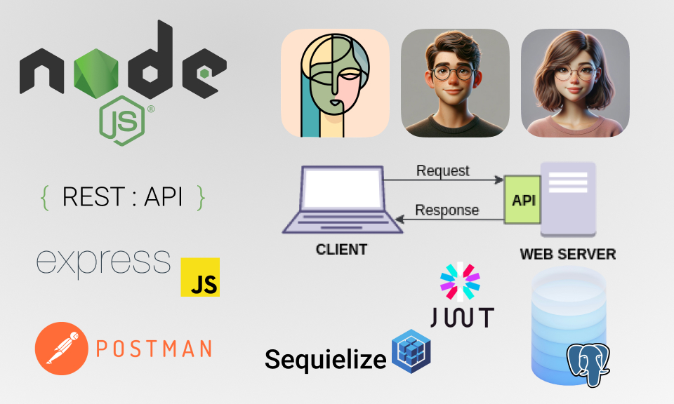

# Contacts management application

#### goit-node-rest-api

  

<h4 align="center">
  REST API application for managing your contacts.
</h4>

## Project description

Store and manage your contacts using a REST API.

* Supports the following routes:
  * `GET /api/contacts` - Returns an array of all contacts.
  * `GET /api/contacts/` - Returns the contact object by `id` or a JSON response in the format `{"message": "Not found"}` with a `404` status if the contact by id is not found.
  * `DELETE /api/contacts/` - Deletes the contact by `id`. Returns the object of the found and deleted contact in JSON format. If the contact by id is not found, returns a JSON response in the format `{"message": "Not found"}` with a `404` status.
  * `POST /api/contacts` - Returns the newly created contact object with fields `{id, name, email, phone}`.
  * `PUT /api/contacts/` - Returns the updated contact object. If the contact by `id` is not found, returns a JSON response in the format `{"message": "Not found"}` with a `404` status.
  * `POST /auth/register` register user

## Quickstart

1) Download the files from the [repository](https://github.com/oleksandr-romashko/goit-node-rest-api).
2) Make sure you have the [latest Node.js LTS version](https://nodejs.org/en/download/package-manager) installed on your machine. 
3) Install the application dependencies using the `npm install` command in your terminal.

## Usage

To start the web-server use `npm start` (for production) or `npm run dev` (for development with daemon) command in your terminal.

[Postman](https://www.postman.com/) application may be used to work and test REST API.

### Additional application settings (.env file)

See [.env.example](./.env.example) file for more details and use it as a reference for creating your own `.env` environment variables file:

* You should set database connection settings.
* You should set your own JWT Secret Key to sign and verify JWTs.
* You may set a specific port value on which the Express server will listen. 
* You may turn on additional debugging info messages option. Please leave it commented for the use in any kind of production environment as it hides additional application implementation details.
